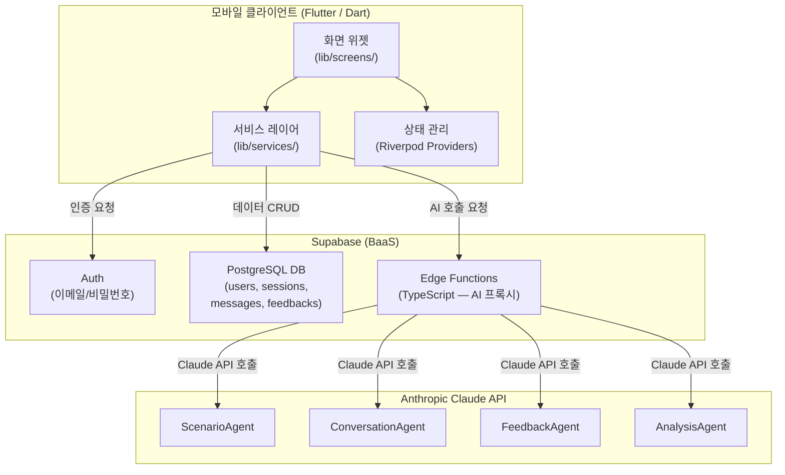
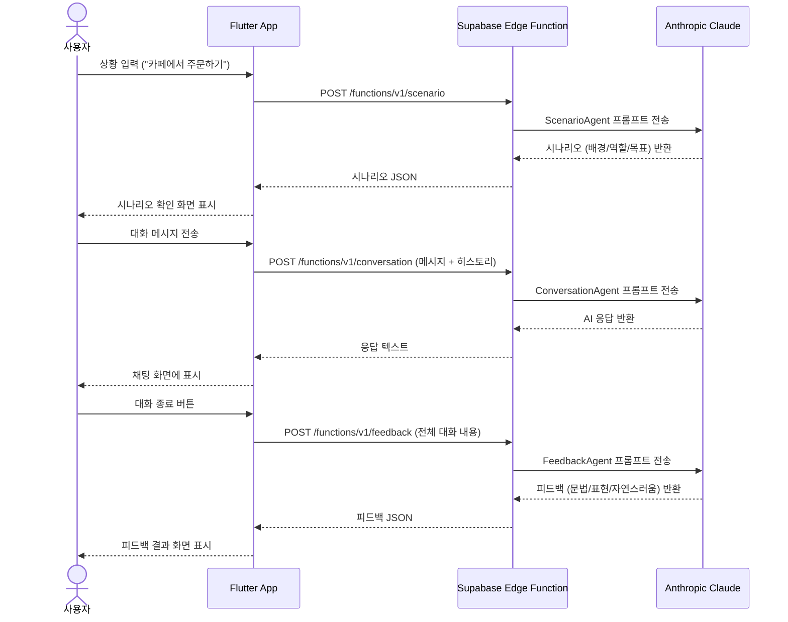
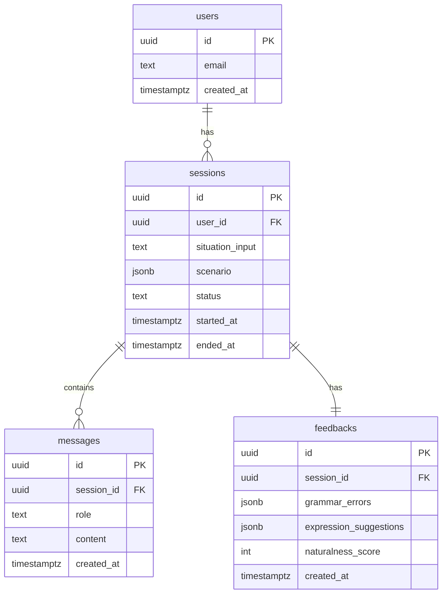
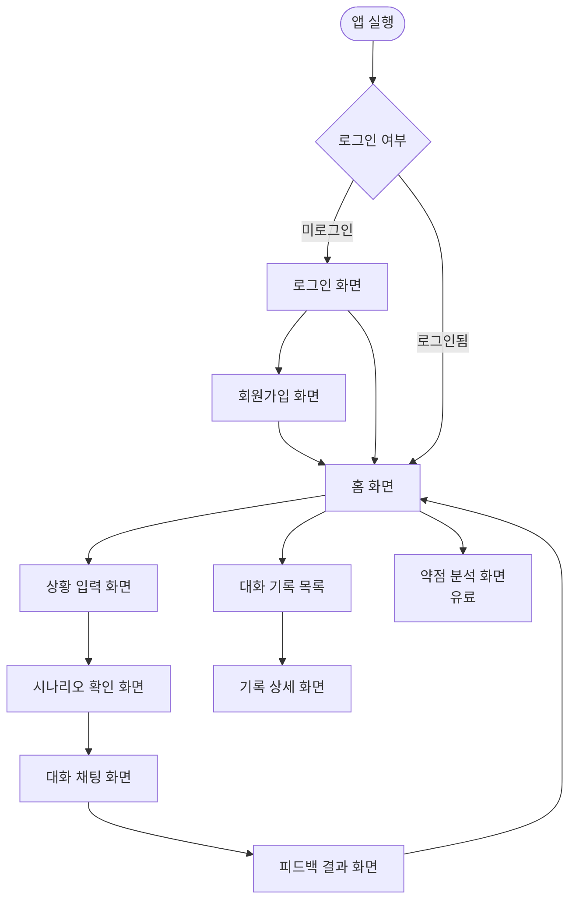

# MEF — 시스템 아키텍처

> 최종 수정: 2026-05-04  
> 관련 ADR: ADR-0001 (Flutter 선택)

---

## 전체 시스템 개요

MEF는 모바일 클라이언트(Flutter) + BaaS(Supabase) + AI API(Anthropic Claude)로 구성된다.
복잡한 자체 백엔드 없이, Supabase가 인증/DB/서버리스 함수를 담당하고
AI 호출은 Supabase Edge Functions(TypeScript)를 통해 서버 사이드에서만 처리한다.

---

## 전체 아키텍처 다이어그램



---

## 레이어별 역할

### 1. 모바일 클라이언트 (Flutter)

```
lib/
├── main.dart               # 앱 진입점, Riverpod ProviderScope 감싸기
├── screens/                # 화면 단위 위젯 (단일 책임)
│   ├── auth/               # 로그인, 회원가입
│   ├── home/               # 홈 화면
│   ├── scenario/           # 상황 입력, 시나리오 확인
│   ├── conversation/       # 채팅 화면
│   ├── feedback/           # 피드백 결과
│   ├── history/            # 대화 기록 목록/상세
│   └── analysis/           # 약점 분석 (유료)
├── widgets/                # 재사용 공통 위젯
├── services/               # AI 및 Supabase 호출 (유일한 외부 통신 레이어)
│   ├── scenario_service.dart
│   ├── conversation_service.dart
│   ├── feedback_service.dart
│   └── analysis_service.dart
├── providers/              # Riverpod 상태 관리 (인증, 현재 세션 등)
├── models/                 # 데이터 모델 (Scenario, Message, Feedback 등)
├── router/                 # go_router 라우팅 설정
└── constants/              # 색상, 폰트, API 엔드포인트 등
```

**핵심 원칙**: 화면 위젯은 UI만 담당, 비즈니스 로직과 AI 호출은 반드시 `services/`에서만 수행

---

### 2. Supabase (BaaS)

```
supabase/
├── migrations/             # DB 스키마 변경 이력
└── functions/              # Edge Functions (TypeScript — AI 프록시)
    ├── scenario/
    ├── conversation/
    ├── feedback/
    └── analysis/
```

**핵심 원칙**: Anthropic API 키는 Edge Functions 환경변수에만 존재. Flutter 클라이언트 코드에 절대 포함하지 않는다.  
**참고**: Supabase Edge Functions는 TypeScript로 작성된다. Flutter 클라이언트는 HTTP POST로 호출한다.

---

### 3. AI Agent 시퀀스



---

## 데이터베이스 스키마



---

## 화면 흐름 (Navigation Flow)



---

## 기술 스택 요약

| 레이어 | 기술 | 선택 이유 |
|--------|------|-----------|
| 모바일 프레임워크 | Flutter (Dart) | 자체 렌더링 엔진으로 iOS/Android UI 완벽 일관성 (ADR-0001) |
| BaaS | Supabase | 인증 + PostgreSQL + Edge Functions 통합 제공 |
| AI API | Anthropic Claude | 긴 컨텍스트 유지, 고품질 한국어/영어 이해 |
| 상태 관리 | Riverpod | Flutter 공식 권장, 컴파일 타임 안전성 |
| 네비게이션 | go_router | Flutter 공식 권장 선언적 라우팅 패키지 |
| 차트 | fl_chart | Flutter 전용 경량 차트 라이브러리 |
